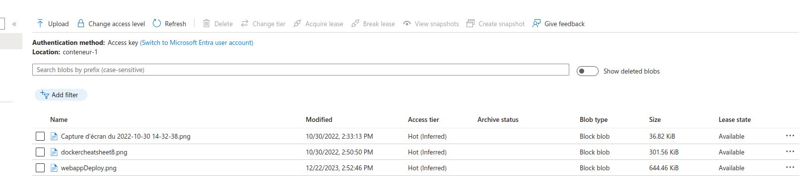

# Projet Azure TP 

Conception et mise en œuvre d'une solution personnalisée à l'aide des services Azure
Dans notre cas nous utilisons les credits student 100$

## Projets de présentation du cloud

### 1. Creation ressources group

Pour toute les actions que l'on va realiser dans Azure nous aurons besoin d'un "groupe".
Azure Resource Group est une ressource logique qui regroupe un ensemble de ressources Azure associées. Ces ressources peuvent être des machines virtuelles, des bases de données, des comptes de stockage, des réseaux, etc. La création d'un groupe de ressources permet d'organiser ces ressources de manière logique et de les gérer de manière centralisée.
J'ai par exemple crée "samix_group" pour y integrer tout mes projets (que vous verrez par la suite).
#### Exemple de commande pour creer un group azure 

az group create --name samix_group --location <votre-emplacement>

### 2. VM azure

Voici une séquence de commandes Azure CLI pour créer une machine virtuelle (VM) 
#### Étape 1: Connexion à Azure

az login
#### Étape 2: Création d'un groupe de ressources

az group create --name MyResourceGroup --location westeurope
#### Étape 3: Création d'une machine virtuelle

az vm create \
  --resource-group MyResourceGroup \
  --name samixx \
  --image canonical:0001-com-ubuntu-server-focal:20_04-lts-gen2:latest \
  --size Standard_D2s_v3 \
  --admin-username azureuser \
  --admin-password Password1234! \
  --authentication-type all \
  --nics "/subscriptions/2b86ae5d-f020-44c6-ba83-3210232f1d2f/resourceGroups/cloud-shell-storage-westeurope/providers/Microsoft.Network/networkInterfaces/samixx497_z1" \
  --storage-sku Standard_LRS \
  --os-disk-name samixx_OsDisk_1_83a3fec228214c1ab6d698d89a5fb247 \
  --os-disk-size-gb 30 \
  --zones 1
#### Étape 4: Ajout d'une règle de pare-feu pour le trafic web

az vm open-port --resource-group MyResourceGroup --name samixx --port 80 --priority 1001

### 3. SQL Database

Notre objectif est de creer une WebApp deployé sur Azure et qui posséde differents services.
Notre db devra être géré de maniere indépendante sur Azure.
Ici l'interface graphique est plus adequat.
commençons par chercher dans azure "Azure Database for MySQL flexible server"

Puis nous associons l'ip de notre machine en local pour faire nos premier test.

Un court scrypt en python va nous permettre de faire la connexion avec notre db distante (voir db.py)

### 4 . Deploy webApp

Voir partie projet 

### 5. Auto Scalling 

Le paramètre "Maximum scale" dans le contexte d'Auto-Scaling pour les applications web Azure représente le nombre maximum d'instances que votre application web peut avoir à un moment donné en réponse à une augmentation de la charge.
Lorsque l'échelle automatique est activée, votre application web peut augmenter ou diminuer automatiquement le nombre d'instances en fonction de la charge du trafic
Par exemple si je configure à 3 mon maximum scale cela signifie que le nombre total d'instances ne dépassera pas 5.

### 6. Set Up Blob Storage

Le blob Storage dans Azure permet de stocker de manière sécurisée et accessible des fichiers.
Pour notre exemple nous allons sotcker une image que nous mettrons ensuite dans ce Readme.
L'avantage est que nous obtenons un lien https apres avoir déposé notre image dans l'espace Blob storage.
[Alt text](images/stock.png) 
Pour voir ou ajouter une photo aller dans sa partie conteneur

 !

Ici la liste des photos déjà stockées

Apres avoir upload notre image nous obtenons un lien : 

l'image que vous voyez ci dessous est en fait stockée sur azure en Blob Storage 

https://stockagesami.blob.core.windows.net/conteneur-1/uploadAzureStorage.png

### 7 . Azure AD
Azure AD est conçu pour offrir des services d'identité et d'accès dans le cloud, permettant aux entreprises de gérer et de sécuriser l'accès à leurs applications et ressources.
Les etapes pour creer un Azure AD : 
-Création d'un groupe dans Azure AD,
-Attribution de rôles à ce groupe,
-Ajout d'utilisateurs au groupe,
-Attribution des rôles spécifiques aux ressources

Le but est de choisir le rôle approprié en fonction des actions que vous souhaitez autoriser pour chaque utilisateurs.

## Partie Projet - Creation App Flask Mysql 

## Etape 1 - Creation Azure Database for MySQL flexible server
 Se referer au 3. Service db pour plus de detail.
 Apres avoir crée notre DB, nous pouvons y accéder depuis notre script python

 ici host = "samix-mysql-server.mysql.database.azure.com"
## Etape 2 - Flask 
 Dans notyre partie Flask nous pouvons faire des methodes CRUD comme un add par exemple :
 
## Etape 3 - Docker 
 Ensuite créer notre conteneur :
 
## Etape 4 - Docker Hub + Web App Azure
  On peut ensuite pousser son image sur le docker hub car nous en auront besoin pour le deploiement de notre webApp.
  Dans notre cas l'image est :"samix94/azureflask"
  
  Apres le déploiement notre application est en ligne avec l'url : https://flaskazuresami.azurewebsites.net/
   

  ## Annexe

Avant de faire ce projet Flask/Mysql, mon objectif était de deployer une app django sur Azure.
Cette application de scrapp n'a pas pu fonctionner pour le moment en deploiement avecv Azure.

lien : https://scraplandd.azurewebsites.net/ 
